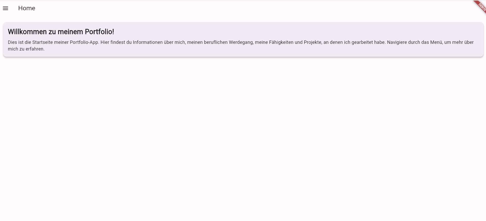
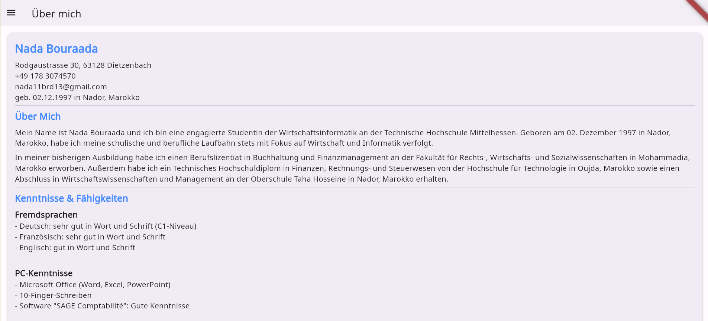
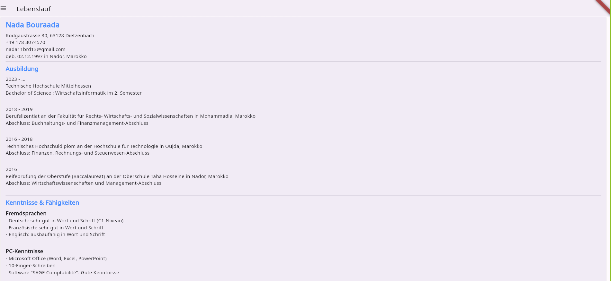
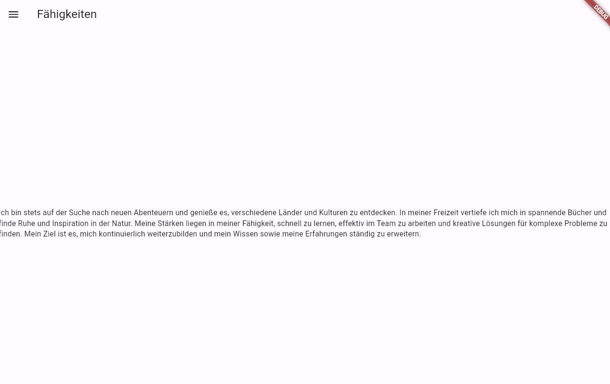

# Meine Portfolio-App

## Überblick

Dies ist eine Portfolio-App, die mit Flutter entwickelt wurde. Die App stellt Informationen über mich, meinen beruflichen Werdegang, meine Fähigkeiten und Projekte dar. Die App verwendet Material Design Komponenten und ist für mobile Geräte optimiert.

## Navigation

Die App verwendet die MaterialApp-Navigation von Flutter. Die Navigation wird durch einen Drawer ermöglicht, der in jeder Seite eingebunden ist.

### Verwendete Widgets

- MaterialApp: Haupt-Widget, das die gesamte App umschließt.
- Scaffold: Basis-Widget für jede Seite, das eine AppBar und einen Drawer enthält.
- AppBar: Zeigt den Titel der Seite an.
- Drawer: Navigationselement, das die verschiedenen Seiten verlinkt.
- SingleChildScrollView: Ermöglicht das Scrollen von Inhalten, wenn der Platz nicht ausreicht.
- ListView: Container für scrollbare Inhalte.
- Card: Zeigt Inhalte in Kartenform an.
- Text: Zeigt Textinhalte an.
- CircleAvatar: Zeigt ein rundes Profilbild an.
- Divider: Trennt verschiedene Abschnitte visuell.

## Seiten

### Home-Seite

Die Home-Seite begrüßt den Benutzer und bietet eine kurze Einführung in die App.

### Über mich-Seite

Die Über mich-Seite enthält persönliche Informationen, Kontaktinformationen und eine kurze Biografie.

### Lebenslauf-Seite

Die Lebenslauf-Seite zeigt meinen beruflichen Werdegang und meine Ausbildung.

### Fähigkeiten-Seite

Die Fähigkeiten-Seite zeigt meine technischen und persönlichen Fähigkeiten.

## Code-Struktur

Der Code ist modular aufgebaut, jede Seite hat ihre eigene Dart-Datei:

- main.dart: Startpunkt der App.
- home.dart: Home-Seite.
- about.dart: Über mich-Seite.
- resume.dart: Lebenslauf-Seite.

- skills.dart: Fähigkeiten-Seite.
- navigation_drawer.dart: Navigation Drawer Widget.
